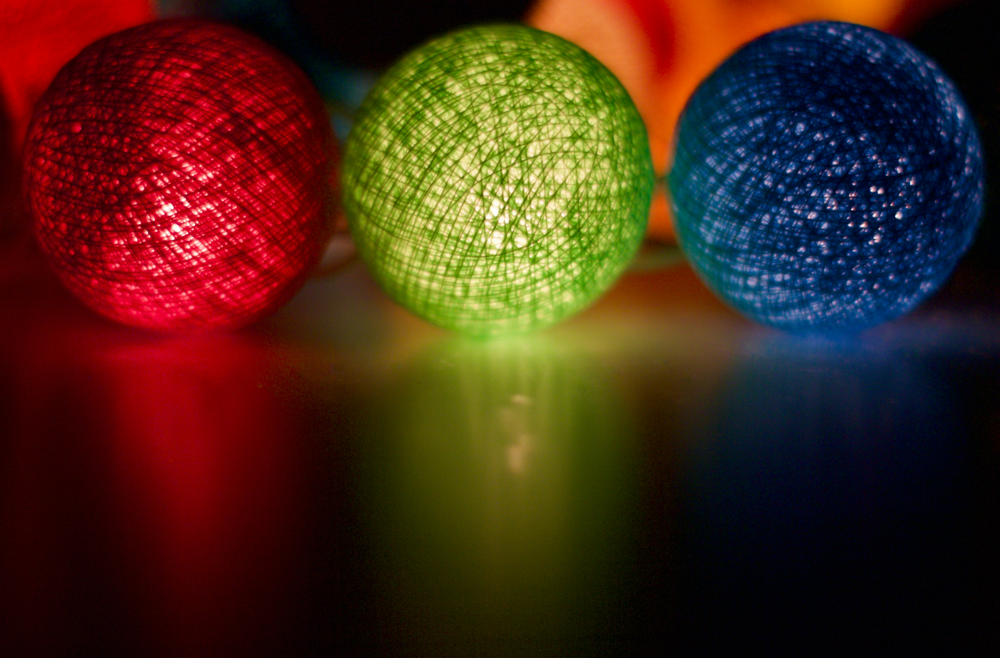
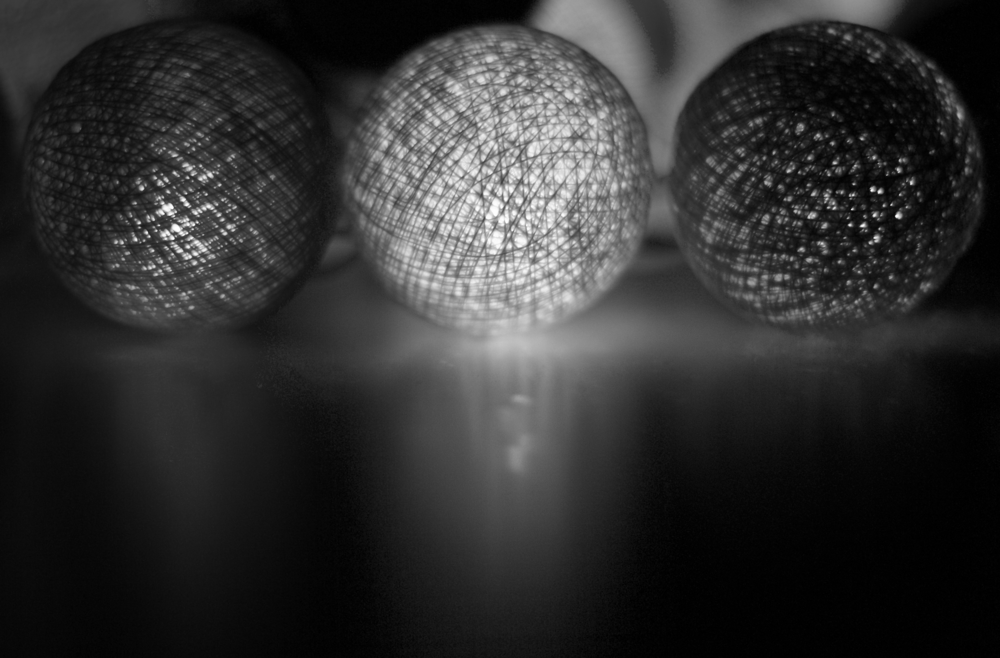
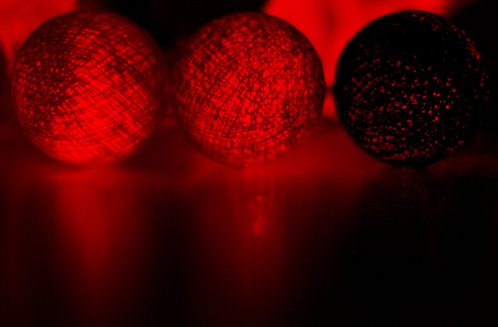

## Digital Image Processing — Lab 1

Basic image processing experiments using Python, OpenCV, NumPy, and Matplotlib.


## 📁 Folder Structure

```text
lab-1/
├── RGB2GREY.py
├── Color_seperation.py
├── black_and_white.py
├── practice.py
├── README.md
└── images/
    ├── color.jpg
    ├── output_red.jpg
    ├── output_green.jpg
    ├── output_blue.jpg
    └── black_and_white.jpg
```


**📂 Experiments**

**1. RGB to Grey**

Extracting individual RGB channels from an image using NumPy and then changing it to grey scale

**Input**





**2. Color Channel Separation**

Separating the Blue, Green, and Red channels using OpenCV.

<p align="center">
  
  
  
  
</p>

<p align="center">
  <b>Original</b>&nbsp;&nbsp;&nbsp;&nbsp;
  <b>Red</b>&nbsp;&nbsp;&nbsp;&nbsp;
  <b>Green</b>&nbsp;&nbsp;&nbsp;&nbsp;
  <b>Blue</b>
</p>


**3. Black & White**

Converting the image to grayscale and then applying binary thresholding.

Grayscale → Thresholding → Binary Image

<p align="center">
  
  
</p>

<p align="center">
  <b>Original</b>&nbsp;&nbsp;&nbsp;&nbsp;&nbsp;&nbsp;&nbsp;&nbsp;&nbsp;&nbsp;&nbsp;&nbsp;
  <b>Black & White</b>
</p>
