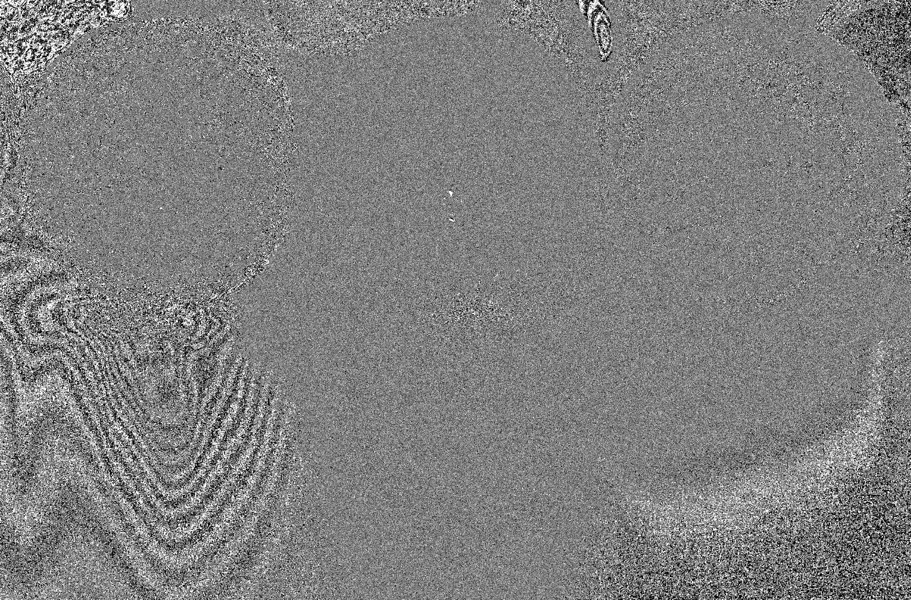
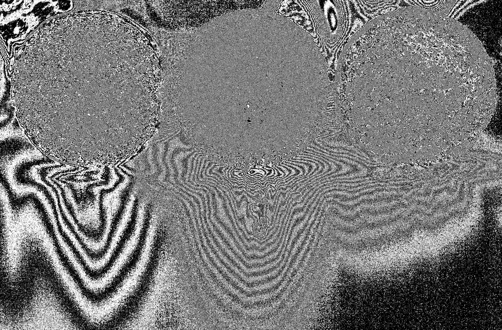
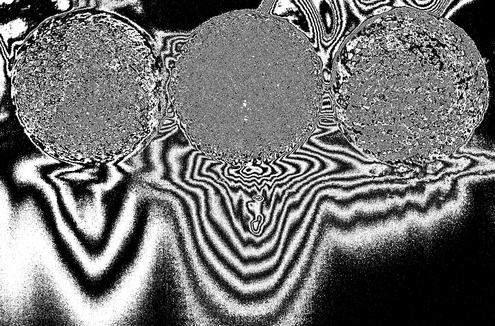
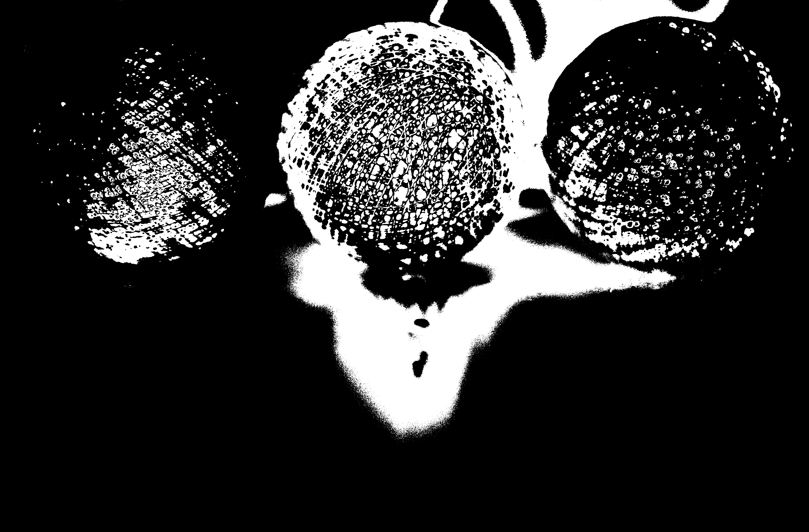
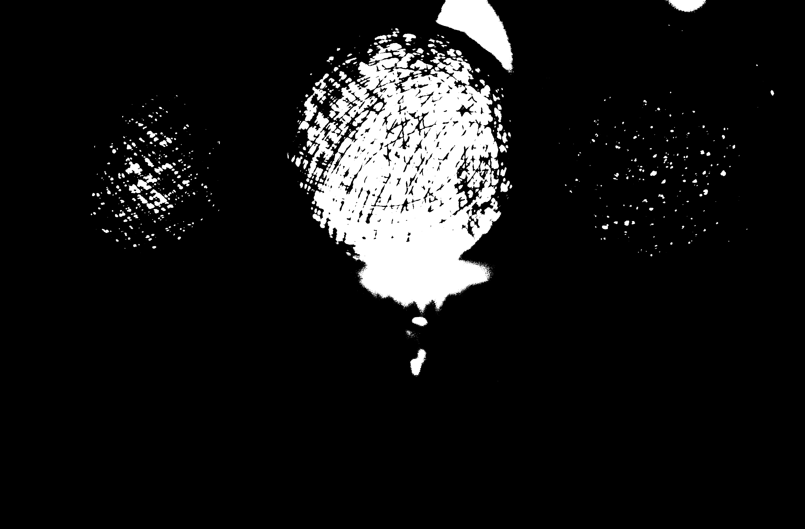
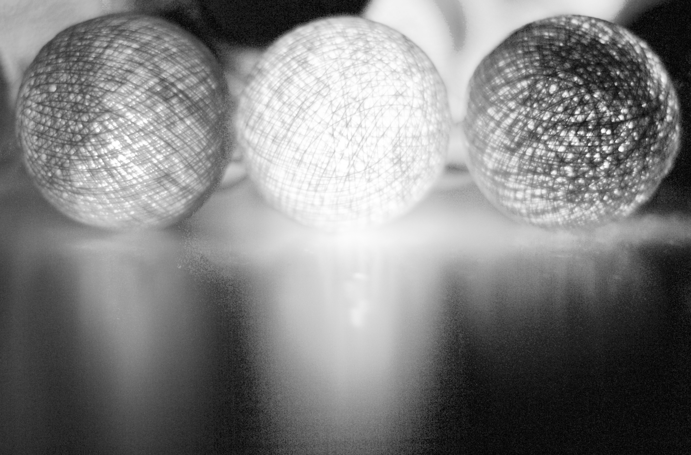

## Digital Image Processing — Lab 2

Basic image processing experiments using **Python, OpenCV, NumPy, and Matplotlib**.

## 📁 Folder Structure

```text
lab-2/
├── bit_plane_slicing.py
├── histogram_equalisation.py
├── README.md
└── images/
    ├── equalized.png
    ├── bit_plane_0.png
    ├── bit_plane_1.png
    ├── bit_plane_2.png
    ├── bit_plane_3.png
    ├── bit_plane_4.png
    ├── bit_plane_5.png
    ├── bit_plane_6.png
    └── bit_plane_7.png

```

📂 Experiments

1. Bit Plane Slicing

Extracting individual bit planes from a grayscale image to analyze the contribution of each bit to the image.

Each pixel in a grayscale image is represented using 8 bits. The image is separated into 8 individual bit planes, from Bit Plane 0 (least significant bit) to Bit Plane 7 (most significant bit).

<p align="center">
  
  
  
  
</p>


<p align="center">
  <b>Bit Plane 0</b>&nbsp;&nbsp;&nbsp;&nbsp;
  <b>Bit Plane 1</b>&nbsp;&nbsp;&nbsp;&nbsp;
  <b>Bit Plane 2</b>&nbsp;&nbsp;&nbsp;&nbsp;
  <b>Bit Plane 3</b>
</p>


<p align="center">
  
  
  
  
</p>

<p align="center">
  <b>Bit Plane 4</b>&nbsp;&nbsp;&nbsp;&nbsp;
  <b>Bit Plane 5</b>&nbsp;&nbsp;&nbsp;&nbsp;
  <b>Bit Plane 6</b>&nbsp;&nbsp;&nbsp;&nbsp;
  <b>Bit Plane 7</b>
</p>

2. Histogram Equalization

Enhancing the contrast of an image using histogram equalization.

<p align="center">
  
</p>

<p align="center">
  <b>Equalized Image</b>
</p>
