# Digital Image Processing

[](LICENSE-MIT)
[](LICENSE-APACHE)
[](LICENSE-BSD)

A collection of my Digital Image Processing laboratory work, experiments, practice programs.

This repository documents my learning journey from basic image manipulation to more advanced image processing techniques.

---

## 📚 About This Repository

This repository contains my implementations and experiments related to Digital Image Processing.

Each laboratory session is organized into its own directory with:

- Python programs
- Input and output images
- Practice programs
- A dedicated `README.md` explaining the work

---

## 🗂️ Repository Structure

```text
Digital-Image-Processing/
│
├── LICENSE
├── LICENSE-MIT
├── LICENSE-APACHE
├── LICENSE-BSD
├── README.md
│
├── task-1/
│   ├── RGB2GREY.py
│   ├── Color_seperation.py
│   ├── black_and_white.py
│   ├── practice.py
│   ├── README.md
│   └── images/
│       ├── color.jpg
│       ├── grey.jpg
│       ├── output_red.jpg
│       ├── output_green.jpg
│       ├── output_blue.jpg
│       ├── Green_Image.jpg
│       ├── black_and_white.jpg
│       ├── avengers.jpg
│       ├── vortex.jpg
│       └── wavelet_transform.jpg
│
├── task-2/
│   ├── bit_plane_slicing.py
│   ├── histogram_equalisation.py
│   ├── README.md
│   └── images/
│       ├── equalized.png
│       ├── bit_plane_0.png
│       ├── bit_plane_1.png
│       ├── bit_plane_2.png
│       ├── bit_plane_3.png
│       ├── bit_plane_4.png
│       ├── bit_plane_5.png
│       ├── bit_plane_6.png
│       └── bit_plane_7.png
│
├── task-3/
│   ├── edge_detection_by_derivative.py
│   ├── robert_edge_detection.py
│   ├── sobel_edge_detection.py
│   ├── wavelet_transform.py
│   ├── README.md
│   └── images/
│       ├── edge.png
│       ├── prewitt_edge.png
│       ├── prewitt_gx.png
│       ├── prewitt_gy.png
│       ├── roberts_edge.png
│       ├── roberts_threshold.png
│       ├── sobel_edge.png
│       ├── sobel_gx.png
│       ├── sobel_gy.png
│       ├── threshold_edge.png
│       ├── x_edge.png
│       ├── y_edge.png
│       └── wavelet_transform.jpg
│
└── ...
```

## 🖼️ Examples

Some of the work I've done so far:

### Original Image


### Red Channel


### Green Channel

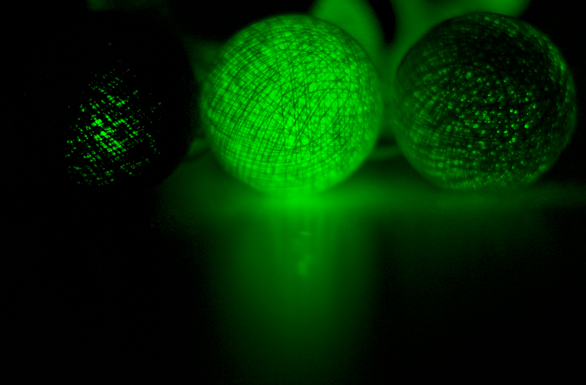

### Blue Channel

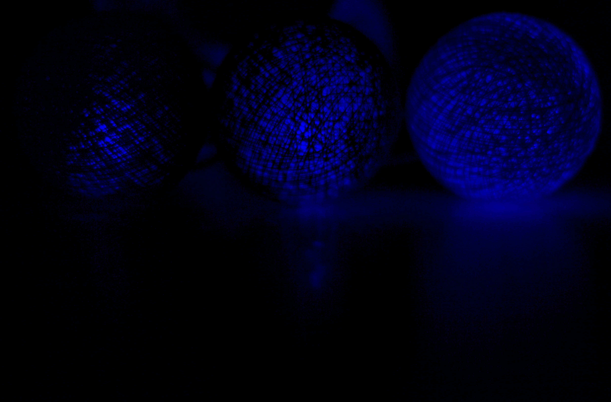

### Black & White

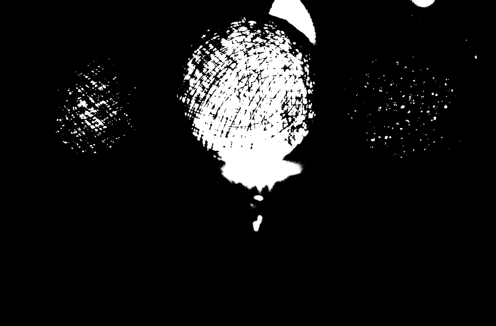

### Grey


### Bit Plane Slicing

<p align="center">
  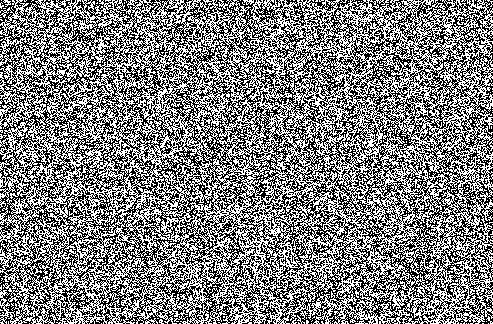
  
  
  
</p>


<p align="center">
  <b>Bit Plane 0</b>&nbsp;&nbsp;&nbsp;&nbsp;
  <b>Bit Plane 1</b>&nbsp;&nbsp;&nbsp;&nbsp;
  <b>Bit Plane 2</b>&nbsp;&nbsp;&nbsp;&nbsp;
  <b>Bit Plane 3</b>
</p>


<p align="center">
  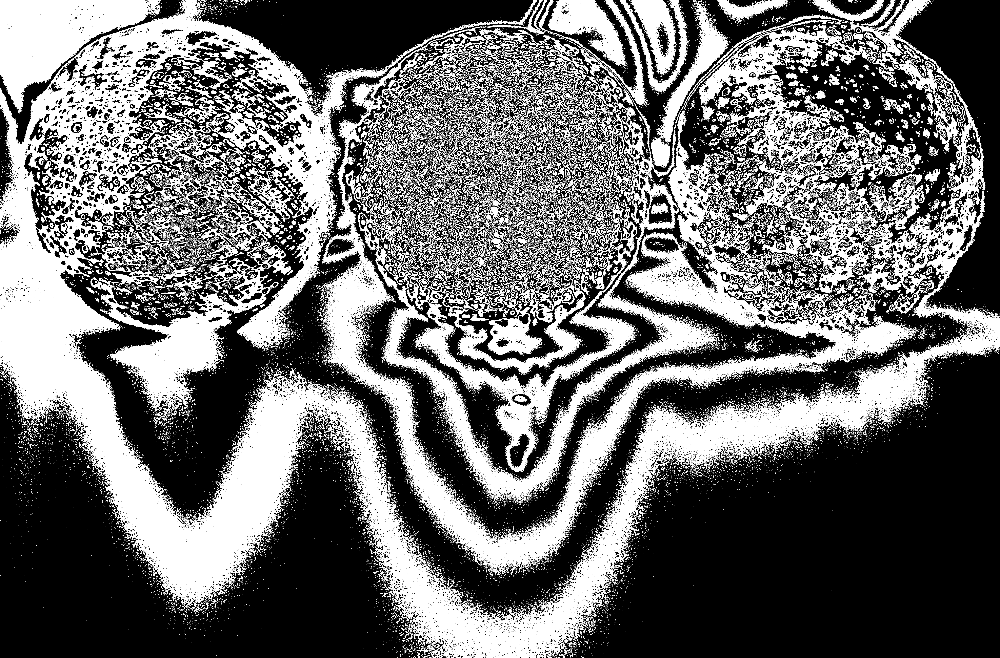
  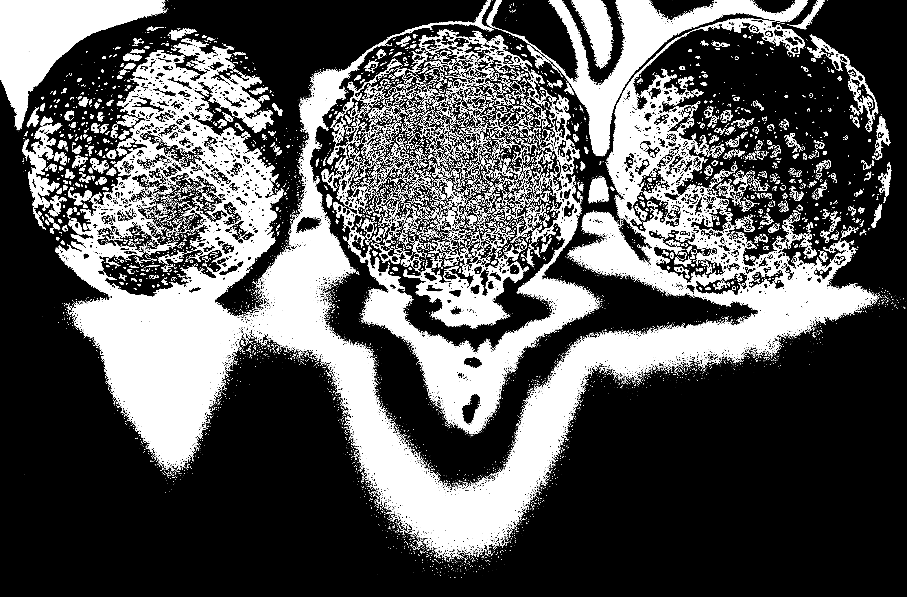
  
  
</p>

<p align="center">
  <b>Bit Plane 4</b>&nbsp;&nbsp;&nbsp;&nbsp;
  <b>Bit Plane 5</b>&nbsp;&nbsp;&nbsp;&nbsp;
  <b>Bit Plane 6</b>&nbsp;&nbsp;&nbsp;&nbsp;
  <b>Bit Plane 7</b>
</p>

### Histogram Equalization

Enhancing the contrast of an image using histogram equalization.

<p align="center">
  
</p>

<p align="center">
  <b>Equalized Image</b>
</p>

### Edge Detection by Derivative

Detecting edges by calculating first-order spatial derivatives along horizontal and vertical directions, followed by gradient magnitude computation and thresholding.

<p align="center">
  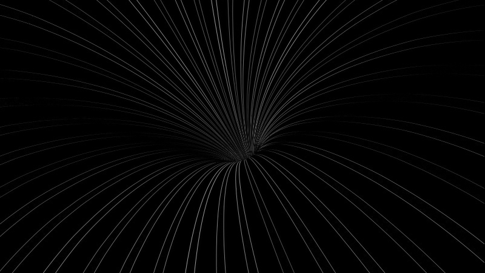
  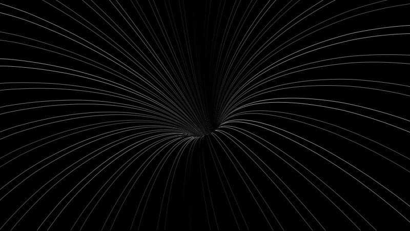
  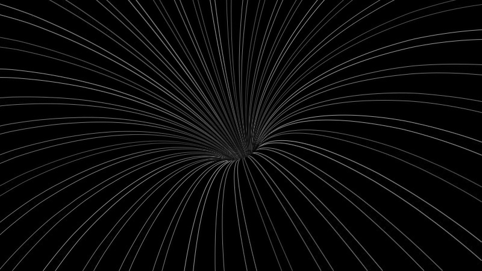
  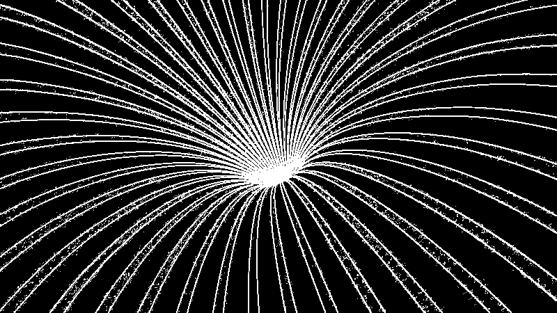
</p>

<p align="center">
  <b>X Direction Edge</b>&nbsp;&nbsp;&nbsp;&nbsp;
  <b>Y Direction Edge</b>&nbsp;&nbsp;&nbsp;&nbsp;
  <b>Overall Edge</b>&nbsp;&nbsp;&nbsp;&nbsp;
  <b>Threshold Edge</b>
</p>

### Sobel Edge Detection

Applying 3×3 Sobel convolution kernels to extract horizontal and vertical gradients and compute the gradient magnitude edge map.

<p align="center">
  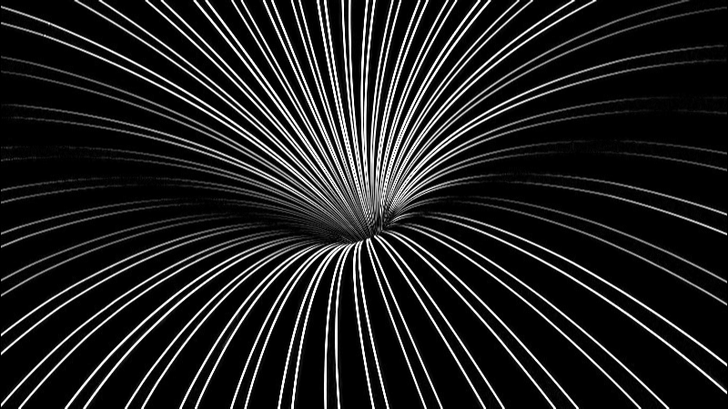
  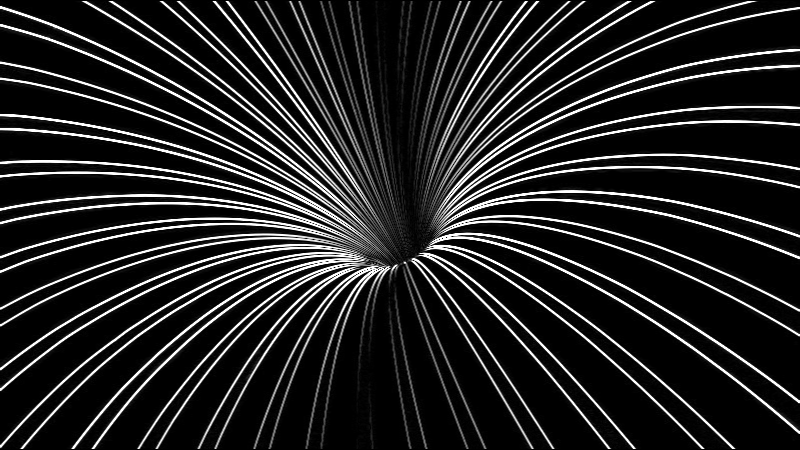
  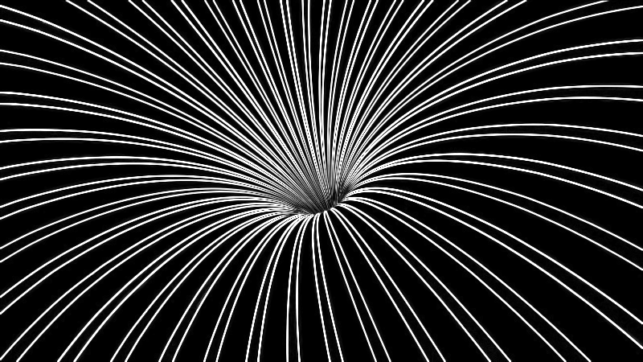
</p>

<p align="center">
  <b>Sobel Gx</b>&nbsp;&nbsp;&nbsp;&nbsp;&nbsp;&nbsp;&nbsp;&nbsp;&nbsp;&nbsp;&nbsp;&nbsp;&nbsp;&nbsp;&nbsp;&nbsp;&nbsp;&nbsp;&nbsp;&nbsp;
  <b>Sobel Gy</b>&nbsp;&nbsp;&nbsp;&nbsp;&nbsp;&nbsp;&nbsp;&nbsp;&nbsp;&nbsp;&nbsp;&nbsp;&nbsp;&nbsp;&nbsp;&nbsp;&nbsp;&nbsp;&nbsp;&nbsp;
  <b>Sobel Edge</b>
</p>

### Prewitt Edge Detection

Utilizing 3×3 Prewitt operators to identify horizontal and vertical gradient components and combined edge boundaries.

<p align="center">
  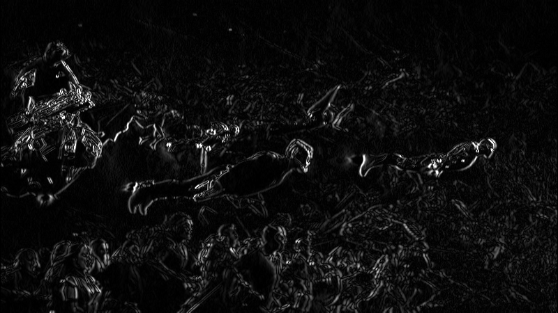
  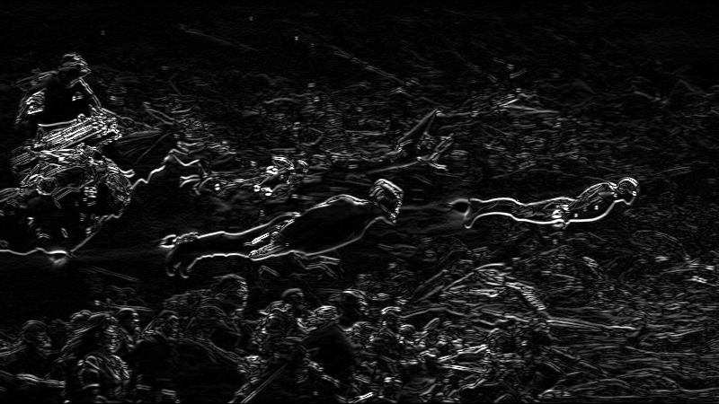
  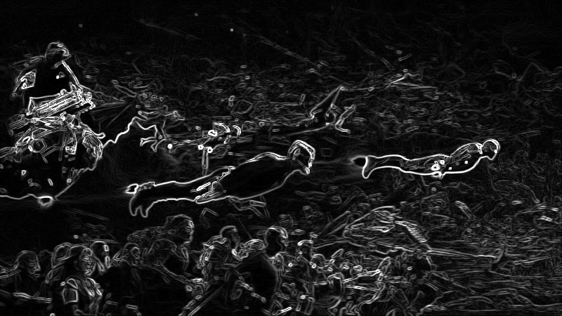
</p>

<p align="center">
  <b>Prewitt Gx</b>&nbsp;&nbsp;&nbsp;&nbsp;&nbsp;&nbsp;&nbsp;&nbsp;&nbsp;&nbsp;&nbsp;&nbsp;&nbsp;&nbsp;&nbsp;&nbsp;
  <b>Prewitt Gy</b>&nbsp;&nbsp;&nbsp;&nbsp;&nbsp;&nbsp;&nbsp;&nbsp;&nbsp;&nbsp;&nbsp;&nbsp;&nbsp;&nbsp;&nbsp;&nbsp;
  <b>Prewitt Edge</b>
</p>

### Roberts Cross Edge Detection

Applying diagonal 2×2 Roberts Cross difference operators to highlight sharp edge transitions and thresholding the output.

<p align="center">
  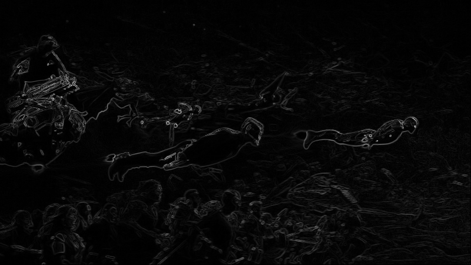
  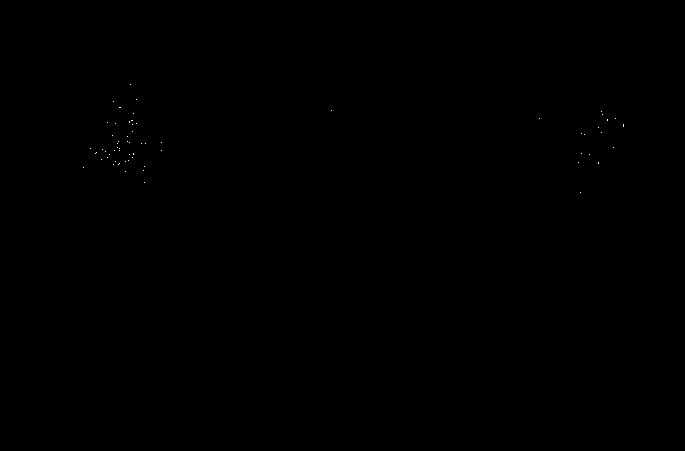
</p>

<p align="center">
  <b>Roberts Edge</b>&nbsp;&nbsp;&nbsp;&nbsp;&nbsp;&nbsp;&nbsp;&nbsp;&nbsp;&nbsp;&nbsp;&nbsp;&nbsp;&nbsp;&nbsp;&nbsp;&nbsp;&nbsp;&nbsp;&nbsp;&nbsp;&nbsp;&nbsp;&nbsp;
  <b>Roberts Thresholded Edge</b>
</p>

### Discrete Wavelet Transform (DWT)

Decomposing the image using 2D Haar Wavelet Transform into approximation (LL), horizontal detail (LH), vertical detail (HL), and diagonal detail (HH) sub-bands.

<p align="center">
  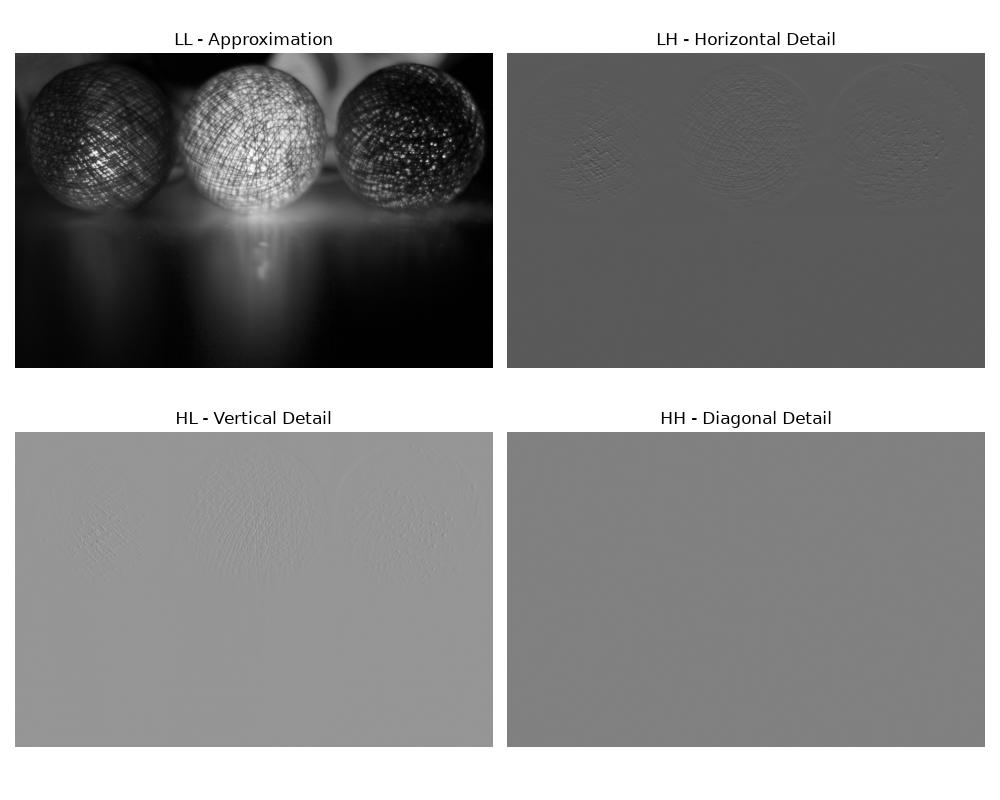
</p>

<p align="center">
  <b>2D Wavelet Decomposition (LL, LH, HL, HH)</b>
</p>

---

## 📄 License

This project is multi-licensed under your choice of any of the following licenses:

- **[MIT License](LICENSE-MIT)**
- **[Apache License 2.0](LICENSE-APACHE)**
- **[BSD 3-Clause License](LICENSE-BSD)**

Copyright (c) 2026 Tharun Geddam. You may select and use this repository under the terms of any of these licenses at your option.
